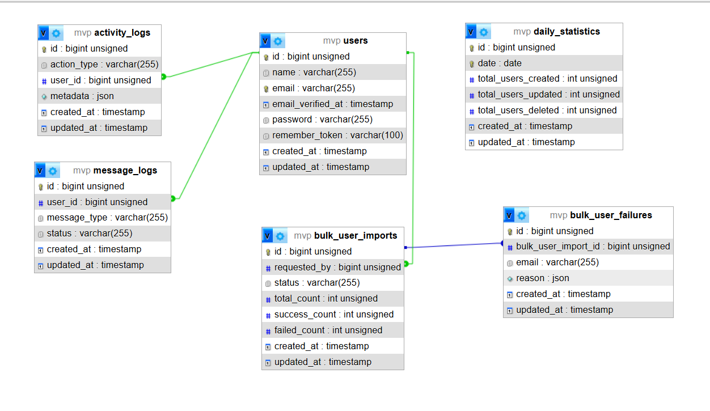

# 🧠 Backend Developer Technical Assessment
## People Management Platform

## 🛠 Technology Stack

- **Framework:** Laravel 11
- **Language:** PHP 8.2+
- **Database:** MySQL
- **Architecture:** Service-Oriented Architecture (SOA)
- **Background Processing:** Jobs, Events, Listeners
- **Notifications:** Laravel Notifications (Simulated)
- **API Documentation:** Postman

---
##  Database Diagram

  
- 
## Postman Collection
 [Open in Postman](https://lively-desert-628807.postman.co/workspace/Node-Js~b6630e98-43d0-4770-b159-4ccdd7c61d06/collection/29015347-4f0cf282-7c09-4400-9ed4-290a992e869b?action=share&creator=29015347)

## ⚙️ Project Setup & Run (Step by Step) ### 1️⃣ Clone the Repository
```bash

git clone https://github.com/ZiadBadr1/MVP.git
cd MVP

# Install dependencies
composer install
npm install && npm run dev

# Create .env file and configure your database
cp .env.example .env

# Generate app key
php artisan key:generate

# Start the development server
php artisan serve

# Start the Queue
php artisan queue:work


